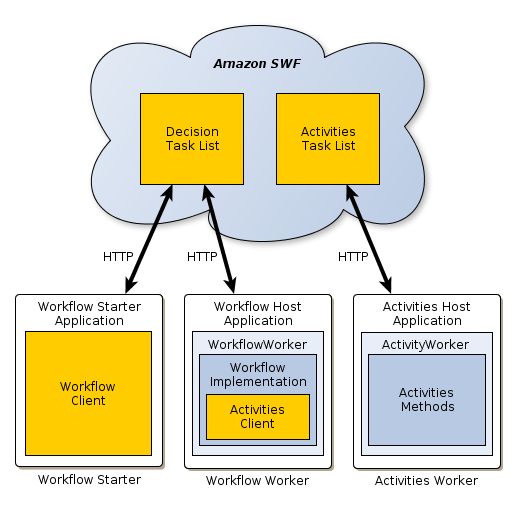

# aws-swf

This project contains some experiments on AWS SWF (Simple Workflow)

Here is the framework model 

# Roles

## Workflow worker

The workflow worker orchestrates the execution of the various activities, manages data flow, and handles failed activities. It consists of:

* The workflow implementation, which includes the activity orchestration logic, handles failed activities, and so on.

* An activities client, which serves as a proxy for the activity worker and enables the workflow worker to schedule activities to be executed asynchronously.

* A WorkflowWorker object, which uses HTTP long poll requests to poll Amazon SWF for decision tasks. If there are tasks on the workflow task list, Amazon SWF responds to the request by returning the information that is required to perform the task. The framework then executes the workflow to perform the task and returns the results to Amazon SWF.

## Workflow Starter

The workflow starter starts a workflow instance, also referred to as a workflow execution, and can interact with an instance during execution in order to pass additional data to the workflow worker or obtain the current workflow state.

The workflow starter uses a workflow client to start the workflow execution, interacts with the workflow as needed during execution, and handles cleanup. The workflow starter could be a locally-run application, a web application, the AWS CLI or even the AWS Management Console.

## Workflow Activities

The activity worker performs the various tasks that the workflow must accomplish. It consists of:

* The activities implementation, which includes a set of activity methods that perform particular tasks for the workflow.
* An ActivityWorker object, which uses HTTP long poll requests to poll Amazon SWF for activity tasks to be performed. When a task is needed, Amazon SWF responds to the request by sending the information required to perform the task. The ActivityWorker object then calls the appropriate activity method, and returns the results to Amazon SWF.
